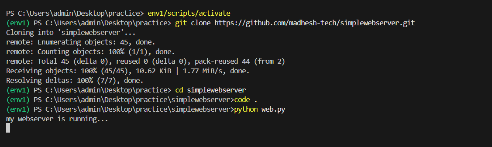

# EX01 Developing a Simple Webserver
## Date:18.03.2025

## AIM:
To develop a simple webserver to serve html pages and display the list of protocols in TCP/IP Protocol Suite.

## DESIGN STEPS:
### Step 1: 
HTML content creation.

### Step 2:
Design of webserver workflow.

### Step 3:
Implementation using Python code.

### Step 4:
Serving the HTML pages.

### Step 5:
Testing the webserver.

## PROGRAM:
from http.server import HTTPServer,BaseHTTPRequestHandler
content="""" 
<!DOCTYPE html>
<html>
<head>
    <title>Simple Table</title>
    
</head>
<body>
    <h2>Student Information</h2>
    <table>
        <tr>
            <th>Name</th>
            <th>Age</th>
            <th>Grade</th>
        </tr>
        <tr>
            <td>Alice</td>
            <td>20</td>
            <td>A</td>
        </tr>
        <tr>
            <td>Bob</td>
            <td>22</td>
            <td>B</td>
        </tr>
        <tr>
            <td>Charlie</td>
            <td>21</td>
            <td>A</td>
        </tr>
    </table>
</body>
</html>
"""
class myhandler(BaseHTTPRequestHandler):
    def do_GET(self):
        print("request received")
        self.send_response(200)
        self.send_header('content-type','text/html; charset=utf-8')
        self.end_headers()
        self.wfile.write(content.encode())
server_address=('',8000)
httpd=HTTPServer(server_address,myhandler)
print("my webserver is running...")
httpd.serve_forever()

## OUTPUT:

 SANTHOSHKUMAR P(212224220055)
## RESULT:
The program for implementing simple webserver is executed successfully.
